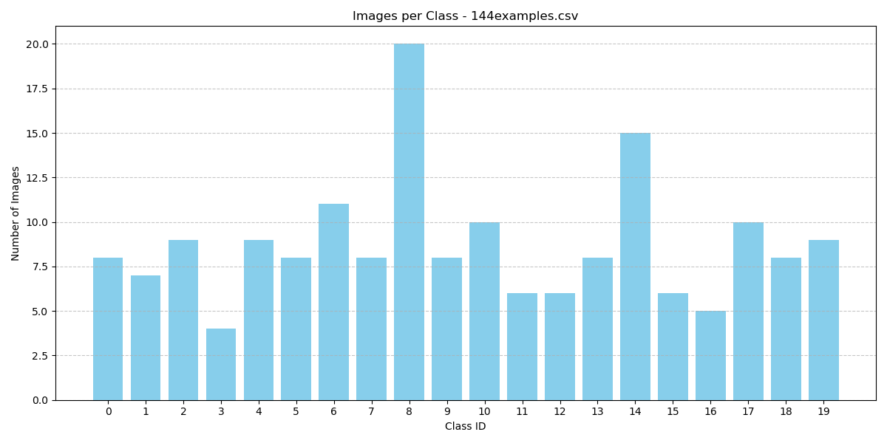
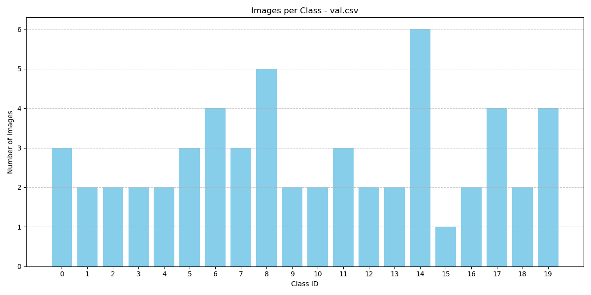
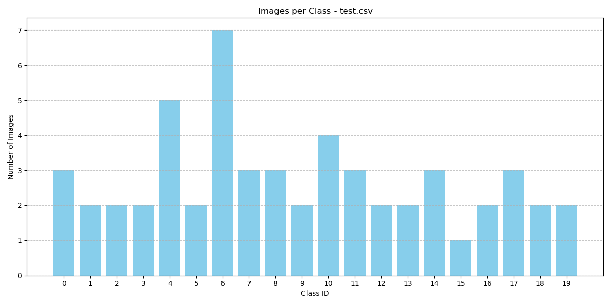

# YOLOv1 Implementation from Scratch

This repository contains a from-scratch implementation of the YOLOv1 (You Only Look Once) object detection model, as described in the paper "You Only Look Once: Unified, Real-Time Object Detection" by Redmon et al. The implementation is built using PyTorch and evaluated on a small subset of the PASCAL VOC dataset (144 training images) due to computational constraints. Two versions of the model are implemented: a Vanilla version closely following the original paper and an Enhanced version with modifications (Adam optimizer, cross-entropy loss, gradient clipping) to improve performance.

## Project Overview

- **This project aims to:**
  - Implement the YOLOv1 model architecture, loss function, dataset handling, utilities, and training pipeline from scratch.

  - Evaluate the model on a small dataset to demonstrate functionality under limited computational resources (limited VRAM).

  - Compare the performance of the Vanilla and Enhanced versions using metrics such as mean Average Precision (mAP), per-class AP, precision, recall, F1 scores, error analysis (Hoiem et al.), and frames per second (FPS).

  - Provide visualizations and detailed error analysis to understand model performance and limitations.
 
  - The implementation is for educational purposes and serves as a proof-of-concept for YOLOv1. Due to the small dataset size, performance is significantly lower than the original paper's results (63.4 mAP for YOLO, 52.7 mAP for Fast YOLO on PASCAL VOC 2007).

## **Implementation Details**

- **Model Architecture (model.py)**

  - Follows the YOLOv1 architecture: 24 convolutional layers followed by 2 fully connected layers, inspired by GoogLeNet.

  - Outputs a 7x7x30 tensor (S=7, B=2, C=20 for PASCAL VOC).

  - `Vanilla Version`: Closely matches the original paper, with a reduced fully connected layer (496 neurons instead of 4096) to accommodate limited VRAM.

  - `Enhanced Version`: Includes batch normalization, gradient clipping (norm=3.0), and a modified loss function (cross-entropy for classification, MSE for others).

- **Loss Function (loss.py)**

  - Implements the multi-part YOLOv1 loss: coordinate loss (lambda_coord=5), objectness loss, no-object loss (lambda_noobj=0.5), and class probability loss.


  - Vanilla Version: Uses Mean Squared Error (MSE) for all loss components.


  - Enhanced Version: Uses cross-entropy for classification loss and MSE for other components.


  - Includes square root transformation for width and height to reduce errors for larger boxes.


  - Debug prints for large losses to aid training stability.

- **Dataset Handling (dataset.py)**

  - Uses a custom VOCDataset class to process a subset of the PASCAL VOC dataset (144 training images).

  - Data augmentation techniques (e.g., RandomScaleTranslate, RandomHSV, RandomHorizontalFlip) were disabled to ensure the production of reasonable and comparable results. Due to the small size of the dataset, these augmentations caused excessive distortion, which hindered effective model convergence.

  - Creates a label matrix in the format SxSx(C+B*5) for training.

- **Utilities (utils.py)**

  Includes functions for:

  - Intersection over Union (intersection_over_union)

  - Non-Maximum Suppression (non_max_suppression)

  - Mean Average Precision (mean_average_precision)

  - Converting grid-based predictions to image-level bounding boxes (cellboxes_to_boxes)

  - Visualization and checkpoint management.

- **Training Pipeline (train.py)**

  - Implements a training loop with gradient accumulation (4 steps, effective batch size of 64, matching the paper).

  - Vanilla Version: Uses SGD optimizer with momentum=0.9.

  - Enhanced Version: Uses Adam optimizer with gradient clipping (norm=3.0).

  - Includes early stopping based on validation mAP and overfitting detection (train_mAP/val_mAP ratio).

  - Logs metrics to TensorBoard (runs/vanilla/ and runs/enhanced/) for analysis.

- **Evaluation (evaluation.py)**

  - Evaluates the model on a test dataset (data/test.csv) with metrics including:

  - Overall mAP and per-class AP at IoU=0.5.

  - Precision, recall, and F1 scores per class.

  - Error analysis based on Hoiem et al. (correct, localization, similar, other, background, false negatives).

  -  FPS benchmarking for batch sizes 1, 8, and 16.

  - Generates visualizations (precision-recall scatter, F1 score bar, confusion matrix, error distribution, etc.) and a comprehensive report in vanilla/results/ and enhanced/results/.

- **TensorBoard Parsing (parse_tensorboard.py)**

  - Extracts training metrics from TensorBoard logs (runs/vanilla/ and runs/enhanced/).

  - Plots loss components, learning rate, mAP progression, and overfitting ratio.

  - Saves plots to vanilla/results/ and enhanced/results/ for analysis.

# Hyperparameters and Parameter Settings:
 |**Parameter**          |**Enhanced version** | **Vanilla** | **Original**|
 |----------------------|---------------------|-------------|-------------|
 | BATCH_SIZE           | 16 (effective 64 via 4 accum. steps)| 16 (effective 64 via 4 accum. steps) |  64 |
 | EPOCHS               |  135                |  135        |  135        |      
 | LEARNING_RATE        |  2e-5               |  2e-5       | Manual Step decay |
 | WEIGHT_DECAY         | 0.0005              | 0.0005      | 0.0005      |
 | Dropout              | 0.0                 | 0.0         | 0.5         |
 | NUM_WORKERS          |  4                  |  4          |     _       |
 | Augmentation         | NO                  | NO          | YES          |
 | Accum_steps         | 4                   | 4           |     NO      |
 | Optimizer            |Adam                 | SGD(momentum = 0.9) | SGD(momentum = 0.9) |
 | Loss function        | Cross entropy + MSE | MSE for all components     | MSE for all components |
 | lambda_nobj          |             0.5     |      0.5    |      0.5     |
 | lambda_cord          | 5                   | 5           | 5            |
 | FC layer 2 Neurons   |                 496 | 496         | 4096         |
 | BATCH NORMALIZATION   | YES                 | YES         |NO            |
 | Gradient Clipping     | YES, NORM = 3.0     | NO   | NO      |


# Instructions before using the model

## Download, GPU, Editor
  * Clone or download the model files to your local machine. This is suitable if you have sufficient computational resources (e.g., a dedicated GPU).

  * If you lack local compute power, upload the project files to your **Google Drive** and run the notebook in **Google Colab**. Colab offers free GPU access, although sessions may disconnect after a period of inactivity. Google Colab can sometimes be inconvenient due to session timeouts in the free version. I only tried free version.

  * I developed the code using **VS Code**, which is ideal for managing full projects and files. For **experimentation and debugging**, platforms like **Jupyter Notebook** or **Google Colab** are more effective, as they allow executing the model in parts (e.g., layer-wise debugging, visualizing intermediate outputs). Jupyter offers better state management for iterative development but may require local setup or hosted environments like JupyterHub.

  <!-- - Download or clone the model files on your local machine if you want to run locally. If you don't have computation power download the files locally upload to the Google drive and run it on Google Colab. I used VS Code to write the code but the better option to create these types of models is Jupyter Notebook, or Google Colab (little inconvenient because system go offline after some time free version) because they help to understand model better by running pieces of the model more effectively which helps in experimentation and to debug the code. -->

  - Download the `PASCAL VOC` dataset and convert it into the required format for our experiments. Split the dataset into three categories: training, validation, and test sets. To understand the expected data organization, please refer to the `Folder Structure` section's `data` directory.
  
   - **Folder structure**:
   
    Directory: C:\Users\pawan\Downloads\YOLOv1_from_scratch
    Mode                 LastWriteTime         Length Name
    ----                 -------------         ------ ----
    d-----         6/25/2025   5:13 AM                .history
    d-----         6/25/2025   3:23 PM                enhanced
    d-----         6/25/2025   3:23 PM                vanilla
    -a----         6/23/2025   2:47 AM           3973 .gitignore
    -a----         6/25/2025   2:43 PM              0 LICENSE
    -a----         6/24/2025   7:15 PM           6197 README.md
    -a----         6/25/2025   2:44 PM              0 requirements.txt
    -a----         6/25/2025   5:13 AM           2617 results.md
    
    Directory: C:\Users\pawan\Downloads\YOLOv1_from_scratch\enhanced
    Mode                 LastWriteTime         Length Name
    ----                 -------------         ------ ----
    d-----         6/23/2025   7:37 PM                data
    d-----         6/25/2025   3:26 PM                results
    -a----         6/20/2025   9:29 PM           5505 dataset.py
    -a----         6/23/2025   1:54 AM           7704 loss.py
    -a----         6/21/2025  11:32 PM           8627 model.py
    -a----         6/23/2025  10:59 PM           5435 parse_tensorboard_1.py
    -a----         6/23/2025   1:54 AM          27761 train.py
    -a----         6/21/2025  10:59 AM          20106 utils.py

    Directory: C:\Users\pawan\Downloads\YOLOv1_from_scratch\enhanced\results
    Mode                 LastWriteTime         Length Name
    ----                 -------------         ------ ----
    d-----         6/24/2025   1:19 AM                predictions
    -a----         6/24/2025   1:19 AM          51730 class_ap.png
    -a----         6/24/2025   1:19 AM         107682 confusion_matrix.png
    -a----         6/24/2025   1:19 AM          33706 error_distribution_bar.png
    -a----         6/24/2025   1:19 AM          32800 error_distribution_pie.png
    -a----         6/24/2025   1:19 AM            941 evaluation.log
    -a----         6/24/2025  11:24 PM           3688 evaluation_report.txt
    -a----         6/24/2025   1:19 AM          54472 f1_scores.png
    -a----         6/23/2025   3:29 AM          17039 learning_rate.png
    -a----         6/23/2025   3:29 AM          84971 loss_components.png
    -a----         6/23/2025   3:29 AM          44640 map_progression.png
    -a----         6/24/2025   1:19 AM          16093 map_score.png
    -a----         6/23/2025   3:29 AM          32465 overfit_ratio.png
    -a----         6/24/2025   1:19 AM          41302 precision_recall.png

    Directory: C:\Users\pawan\Downloads\YOLOv1_from_scratch\vanilla\data
    Mode                 LastWriteTime         Length Name
    ----                 -------------         ------ ----
    d-----         6/22/2025  11:58 PM                images
    d-----         6/23/2025  12:29 AM                labels
    -a----         6/22/2025  11:02 PM           3451 144examples.csv
    -a----         6/22/2025  10:34 PM            376 1_class.csv
    -a----         6/22/2025   9:03 AM           1181 test.csv
    -a----         6/22/2025   9:02 AM           1134 val.csv

    SAME STRUCTURE FOR THE VANILLA VERSION

### Customized Dataset Selection

Due to **limited computational resources**, a carefully curated **subset of the PASCAL VOC dataset** was used. The key goals were:

* Ensure **all 20 object classes** are represented.
* Keep the dataset **small and computationally manageable**.
* Prefer images with **fewer and larger objects**, avoiding small cluttered scenes that YOLOv1 struggles with.

### Dataset Breakdown

| Split      | Examples | Notes                              |
| ---------- | -------- | ---------------------------------- |
| Train      | 144      | Covers all 20 PASCAL VOC classes   |
| Validation | 44       | Used for hyperparameter tuning     |
| Test       | 43       | Used for evaluation and comparison |

> **Note**: Data split is balanced to the extent possible, but rare classes (like `potted plant`) still have limited examples.

### Why Avoid Dense Scenes?

* YOLOv1 is known to struggle with **small or densely packed objects**, especially when **multiple objects share a grid cell**.
* Including such images led to **unstable loss**, **non-converging training**, and poor bounding box predictions.
* By using **cleaner images**, the model training became **more stable** and the results **more interpretable**.

### Data Distribution Graph
   <p align="center">
      
      
   </p>
   <p align="center">
   
   </p>
   </p>
   <p align="center">
      
      
   </p>

   `Note: Please use the full PASCAL VOC dataset for better results.`

# How to use the model:

## 1. Dataset

- A small subset of PASCAL VOC (144 training images) is used, with images and labels in data/images/ and data/labels/.

- CSV files (data/144examples.csv, data/val.csv, data/test.csv) specify image and label paths.

- **Expected directory structure:**

  - data/
    - images/
      - image1.jpg
      - image2.jpg
      - ...
    - labels/
      - image1.txt
      - image2.txt
      - ...
    - 144examples.csv
    - val.csv
    - test.csv


- `**Note:** For better performance, use the full PASCAL VOC 2007 or 2007+2012 dataset.

## 2. Setup Instructions

Prerequisites

Install dependencies:
```python
pip install -r requirements.txt
```

## 3. Running the Code

- Train the Model:
  ```python
  # For enhanced version
  enhanced/python train.py
  # For vanilla version
  vanilla/python train.py
  ```
- Outputs checkpoints to `vanilla_model.path.tar (Vanilla)` and `enhanced_model.path.tar (Enhanced)`.
- Logs metrics to `runs/` for `TensorBoard`.


## 4.  Evaluate the Model

Generates evaluation reports, visualizations, and logs in the specified output directory.

  
# Experimentation with the Model: My Observations

## **Data**

### **Customized Dataset**

* **Data is the soul of this experimentation**. Without quality data, the model cannot perform effectively—it's like a car without fuel.
* In the original YOLOv1 paper, the authors demonstrated strong performance using the **PASCAL VOC dataset**, which is large enough and well-structured.
* Due to computational (hardware) limitations, I created a custom dataset of good quality, as detailed earlier in the section `Instructions before using the model.`
* This careful curation helped the model **detect objects more efficiently** and **produce comparable results**, despite the smaller dataset.
* The larger and more diverse the dataset, the **better the model can extract features** and **more accurately localize objects**.

### **Economy of the Original Dataset**

* YOLOv1 achieved **63.4 mAP** by training on a **large dataset** using **pretrained weights** over the course of a **week**.
* The scale and quality of the original dataset, along with extensive training time, played a major role in achieving such high performance.

### **Our Experiment**

* From my experiments, it’s evident that the model is **receiving and processing the custom data effectively**, and it is capable of producing reasonable results.
* However, the **main limitations** were:

  * **Lack of computational resources**
  * **Absence of pretrained weights compatible with PyTorch**
  * **Small data**
* Having such pretrained weights would have been extremely helpful for feature extraction and faster convergence.

## **Learning Rate**

* I tried to follow the original learning rate schedule proposed in the YOLOv1 paper. It involves a **manual step decay** approach:

  * Initially, the learning rate is slowly increased from `1e-3` to `1e-2`.
  * Then training proceeds with:

    * `1e-2` for the first 75 epochs
    * followed by `1e-3` for 30 epochs
    * and finally `1e-4` for the last 30 epochs.
  * This gradual step-down strategy is meant to stabilize training. Starting directly with a high learning rate (`1e-2`) can cause the model to diverge due to **unstable gradients**.

* In my case, using this schedule **led to gradient explosions early in training**. This suggests that the model overshot the minimum loss region too quickly, causing the gradient values to explode and the loss to become `NaN`.

* I also experimented with various alternative learning rates:

  * `1e-4`, `1e-5`, and `2e-6`.

    * **Lower learning rates** like `2e-6` often resulted in very **slow** convergence or **stagnation**—the loss would oscillate or plateau with no significant improvement.
    * **Higher learning rates** led back to gradient explosion and instability.

* I also applied several stabilization techniques, including:

  * **Sigmoid activation functions**
  * **Gradient clipping**
  * **Gradient accumulation**
    Despite these, the model still failed to converge effectively.

* To improve results, I increased the dataset size to **500 training images** and **200 images** each for validation and testing. However, this still did not yield any noticeable improvements. The loss function kept oscillating, and the model appeared stuck in a shallow local minimum, unable to progress further.

* After extensive experimentation, I concluded that the **main issue was the dataset**:

  * I implemented YOLOv1 entirely **from scratch**, without any **pretrained weights**.
  * The original YOLOv1 was trained using pretrained weights (from **ImageNet**) on a large dataset like **PASCAL VOC**, and the training spanned **weeks** on powerful hardware (`Titan X GPU`).
  * My custom dataset had a lot of **visual clutter**, **small background elements**, and **multiple objects per image**, which posed challenges to the model.
  * This is one of the known limitations of YOLOv1—it struggles when too many small objects are densely packed in an image or when the dataset is noisy.

* In conclusion, even with well-tuned hyperparameters, if the model is not converging properly, the root cause might be **data quality** or **insufficient data volume**.

## **Neurons in Fully Connected Layers**

* The number of neurons in the fully connected (FC) layers can be adjusted based on your dataset size and how well the model is fitting the data.

* In my experiments, I initially used **4096 neurons** (as in the original YOLOv1 architecture). However, with my current setup and small dataset, the model's training started to **oscillate** after some time. The loss **plateaued early**, indicating that the model stopped learning effectively.

* This behavior suggests that the model was trying to compute too much from too little data. When the dataset is small, having a large number of neurons results in many parameters (weights) that cannot be updated meaningfully. Although the learning rate may be appropriate and the gradients may not explode immediately, **minor instabilities can push the system toward divergence** or back into a loop of oscillation.

* It’s important to remember that **images are just numerical matrices**, and in neural networks, we multiply these numbers with weights (associated with neurons) to extract features. When we increase the number of neurons significantly while working with a small dataset:

  * The large number of learnable weights can **overpower the signal** from the input data.
  * This can lead to **cluttered learning**, where the model’s parameters no longer reflect the true underlying patterns in the images.

* To address this, I **reduced the size of the FC layer to 496 neurons**. This helped prevent **overfitting**, which is common when using large-capacity models on small datasets.

  * However, the trade-off is that **reducing neurons also limits the model’s learning capacity**, making it harder to capture more complex patterns.

## **Bias**

* **Bias** is a small value added in the activation function computation, typically at each neuron or convolutional filter. Its main purpose is to **shift the activation**, allowing the model to better fit the data and **stabilize the learning process**.
* Bias plays a crucial role in **preventing dead neurons**, which occur when a neuron's output becomes zero and stops contributing to learning.
* In my implementation, I chose to use **Batch Normalization** instead of explicit bias terms. Batch Normalization:

  * **Accelerates convergence**
  * **Stabilizes training**
  * **Internally handles bias and scaling**, effectively removing the need for separate bias terms
* This approach **differs from the original YOLOv1 implementation**, which included bias terms explicitly.
* However, in my case—both for the **vanilla** and **enhanced** versions of the model—using Batch Normalization yielded better convergence and more stable training, making it a practical substitution despite the deviation from the original architecture.

## **Gradient Clipping**

* **Gradient clipping** was applied **only in the enhanced version** of the model.
* In the **vanilla version**, using gradient clipping had a **negative impact**: it significantly **slowed down the learning process** and hindered effective training.
* Gradient clipping is a valuable technique when using **high learning rates**, as it prevents **gradient explosion** by capping the gradients to a maximum threshold.
* This is especially important during the **early stages of training**, when gradients can become unstable and extremely large.
* In the enhanced version, where stability was a higher priority, gradient clipping helped maintain training consistency and prevented divergence.

## **Overfitting**

* **Overfitting** was one of the key issues observed during training, primarily due to the following factors:

  * **No dropout layers** were used, which typically help regularize the model by preventing co-adaptation of neurons.
  * **Fewer neurons** in the fully connected layers reduced the model's capacity but also limited its ability to generalize well from the training data.
  * **No data augmentation** was applied, which meant the model was exposed to very limited variations of the training examples.
  * The dataset itself was **small and lacked diversity**, making it harder for the model to learn generalized patterns.

* Despite following best practices—such as using separate **training**, **validation**, and **test** sets—overfitting still occurred.

* This was mainly because of the absence of **dropout**, **data augmentation**, and **sufficient model complexity** to capture diverse patterns while avoiding memorization.

* In short, while my model aimed for generalization, the limited data and lack of regularization techniques led to overfitting in the final training stages.

## **Why No Augmentation**

* I chose **not to apply data augmentation** during training because the dataset was **small**, and using heavy augmentation techniques introduced **too much distortion**—both in the images and in their corresponding bounding boxes.
* This distortion led to:

  * Misaligned bounding boxes
  * Unstable gradients
  * Significantly higher loss values
* As a result, the model became unstable during training and began producing **NaN (Not a Number)** values, making evaluation and comparison of results impossible.
* I did **not experiment with lighter augmentation strategies**, so it remains unclear whether a more subtle approach could have avoided gradient explosion.
* However, given the already high loss and training instability, **implementing augmentation at this stage was not feasible**.

## **Non-Maximum Suppression (NMS)**

* The **NMS (Non-Maximum Suppression)** process plays a **significant role** in object detection performance, but in my experiments, I chose to **stick closely to the original YOLOv1 settings**.
* As the name suggests, NMS works by **suppressing all bounding boxes except the one with the highest confidence score** for each object detection.
* This process relies heavily on two factors:

  * **IOU (Intersection over Union)**: measures the overlap between predicted boxes.
  * **Class-specific confidence scores**: determine the strength of predictions.
* By adjusting IOU thresholds or confidence score cutoffs, we can **increase or decrease the number of final bounding boxes**, which in turn has a **direct impact on recall and precision**:

  * Lower thresholds may lead to **more detections** (higher recall, lower precision).
  * Higher thresholds may lead to **fewer detections** (higher precision, lower recall).
* For consistency and comparability, I retained the original NMS configuration throughout the experiments.

### **Loss Function Constants**

* I did **not experiment with modifying the constants** used in the YOLOv1 loss function for this version of the model.
* Although I explored such adjustments in earlier versions, for this implementation I chose to **stick to the original YOLOv1 loss weights** for consistency and comparability.
* On **small datasets** like mine (only 144 images), certain constants—such as the **5.0 multiplier for localization coordinates**—can have a **significant impact** on model performance.

  * In my case, this default setting actually worked well and helped the model converge effectively.
* However, further improvements could potentially be made by tuning the loss function components:

  * For example, adjusting the **classification loss weight** or the **confidence score weight** by multiplying them with custom constants. (In original version these were untouched)
* These adjustments can be tracked and monitored using the **Summary Writer**, which I have already integrated into the code for logging and visualization.

## Limitations

**Small Dataset**: The 144-image training set limits generalization, resulting in low mAP (0.0568–0.0949 vs. 63.4 in the paper).


**Computational Constraints**: Training and evaluation were performed on limited hardware, preventing use of the full PASCAL VOC dataset.


**Localization Errors**: Both models struggle with precise bounding box prediction, a known YOLOv1 limitation exacerbated by the small dataset.


**Disabled Augmentation**: Data augmentation was disabled to avoid overfitting on the small dataset, but enabling it with the full dataset 
could improve results.

## Results

For detailed evaluation metrics, visualizations, and logs, please refer to [**results.md**](./results.md).

## Conclusion

Please refer to the [**conclusion file**](./conclusion.md) for a summary of insights, challenges, and reflections on the implementation process.

## License

For licensing information, see the [**LICENSE**](./LICENSE) file.

## Future Work

- Train on the full PASCAL VOC 2007+2012 dataset to approach the paper’s 63.4 mAP.
- Use pretrained ImageNet weights compatible with PyTorch implementation of YOLOv1.
- Systematically compare the Vanilla and Enhanced versions to identify performance gaps, and derive new methodologies to further optimize the model.
- Perform deep analysis of the dataset to identify class imbalance or underrepresented categories. Due to the small dataset size, certain classes may be under-sampled, which can significantly impact detection accuracy and learning dynamics.
- Enable light augmentation (e.g., RandomHorizontalFlip) specifically for the cat class, and fine-tune the trained version of the model on the cat class and other undetected or poorly detected classes. This will help explore class-specific behavior, identify performance bottlenecks, and guide targeted improvements.
- Enable data augmentation (RandomScaleTranslate, RandomHSV, RandomHorizontalFlip) to improve robustness.
* Experiment with Fast YOLO (which uses 9 convolutional layers) to increase inference speed (FPS), and explore speed-accuracy trade-offs.
- Add size-based error analysis to better understand performance degradation on small vs. large objects.
* Further optimize the **Enhanced version** by:

  * Tuning `lambda_coord` and `lambda_noobj` for better localization
  * Enable Dropout in fully connected layers to prevent overfitting and improve generalization.
  * Adjust Non-Maximum Suppression (NMS) thresholds to refine bounding box selection and improve detection precision.

## Acknowledgments
* Inspired by the **YOLOv1** paper by *Joseph Redmon et al.*
* Developed using **PyTorch** and evaluated on a custom subset of **PASCAL VOC**.
* Error analysis approach adapted from the methodology of *Hoiem et al.*
