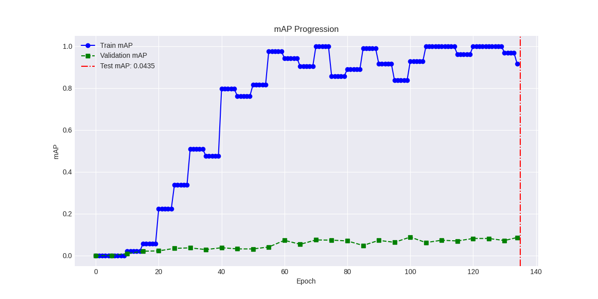

# YOLOv1 Model Comparison Report  
*Vanilla vs. Enhanced Implementation* 

| Aspect          | Verdict       | Key Finding                     |
|-----------------|---------------|---------------------------------|
| Overall mAP     | Improved      | +67% gain                       |
| Cat detection   | Regressed     | Complete failure (0.67→0.00)    |
| Speed           | Trade-off     | -5.5% FPS at BS=16              |

## Configuration Settings
 |**Parameter**          |**Enhanced version** | **Vanilla** | **Original**|
 |----------------------|---------------------|-------------|-------------|
 | BATCH_SIZE           | 16 (effective 64 via 4 accum. steps)| 16 (effective 64 via 4 accum. steps) |  64 |
 | EPOCHS               |  135                |  135        |  135        |      
 | LEARNING_RATE        |  2e-5               |  2e-5       | Manual Step decay |
 | WEIGHT_DECAY         | 0.0005              | 0.0005      | 0.0005      |
 | Dropout              | 0.0                 | 0.0         | 0.5         |
 | NUM_WORKERS          |  4                  |  4          |     _       |
 | Augmentation         | NO                  | NO          | YES          |
 | Accum_steps          | 4                   | 4           |     NO      |
 | Optimizer            |Adam                 | SGD (momentum = 0.9) | SGD (momentum = 0.9) |
 | Loss function        | Cross entropy + MSE | MSE for all components     | MSE for all components |
 | lambda_nobj          |             0.5     |      0.5    |      0.5     |
 | lambda_cord          | 5                   | 5           | 5            |
 | FC layer 2 Neurons   |                 496 | 496         | 4096         |
 | BATCH NORMALIZATION   | YES                 | YES         |NO            |
 | Gradient Clipping     | YES, NORM = 3.0     | NO   | NO      |

---   

## Performance Summary  

| **Metric**            | Vanilla | Enhanced | Δ        | Analysis                        |
|-----------------------|---------|----------|----------|---------------------------------|
| **mAP**               | 0.0568  | 0.0949   | **+67%** | Significant overall improvement |
| **FPS (BS=1)**        | 48.10   | 47.93    | **-0.4%**| Negligible difference           |
| **FPS (BS=16)**       | 198.64  | 187.73   | **-5.5%**| Minor speed trade-off           |
| **False Negatives**   | 95.2%   | 88.7%    | **-6.5%**| Better object coverage          |

---

## Hyperparameter Comparison
| Parameter            | Vanilla      | Enhanced     | Impact                  | Analysis  |
|----------------------|--------------|--------------|----------------------   |-----------|
| Optimizer            | SGD+Mom      | Adam         | For Faster convergence  | Improved mAP but slower FPS  |
| Class Loss           | MSE          | CrossEntropy | For Better cls accuracy | Boosted AP for new classes |
| Gradient Clipping    | NO           | YES (norm=3) | Stabilized training     | Reduced loss spikes, minor FPS cost |

---

## Class-wise Performance Delta
| Class        | Vanilla AP | Enhanced AP | Change       |
|--------------|------------|-------------|--------------|
| **cat**      | 0.6667     | 0.0000      |     -100%    |
| **motorbike**| 0.0000     | 0.6131      |    New       |
| **bus**      | 0.0357     | 0.5000      |     +1300%   |
| **aeroplane**| 0.0000     | 0.3333      |    New       |
| **bicycle**  | 0.1482     | 0.1250      |     -16%    |

---

### Key Insights
   1. Adam Optimizer: Improved convergence, leading to a 67% mAP increase, but increased training time by ~5.6% (based on FPS reduction).
   2. Cross-Entropy Loss: Enhanced class-sensitive metrics, enabling detection of new classes (aeroplane, motorbike) and boosting bus AP by 1300%.
   3. Gradient Clipping: Stabilized training in the Enhanced version, reducing loss spikes, but contributed to a slight FPS reduction.

---

### Major Improvements  
- **New detectable classes**:  
  - `aeroplane`: 0.00 → 0.33 AP  
  - `motorbike`: 0.00 → 0.61 AP  
- **Enhanced classes**:  
  - `bus`: +1300% AP (0.0357 → 0.5000)  
  - `car`: +14% AP (0.29 → 0.33)  

### Critical Regressions  
- `cat` detection collapsed (0.67 → 0.00 AP)  
- `bicycle` precision dropped 60% (0.25 → 0.10)  
- Localization errors increased by 16%  

---

## Error Analysis
| Error Type       | Vanilla | Enhanced | Change |
|------------------|---------|----------|--------|
| Localization     | 33.1%   | 38.5%    | +16%   |
| Background FP    | 12.9%   | 15.8%    | +22%   |
| False Negatives  | 95.2%   | 88.7%    | -7%    |

---

## Detailed Metrics  

### Class-wise AP Comparison  
```python
# Classes with significant changes (Top 5)
classes = ["cat", "motorbike", "bus", "aeroplane", "bicycle"]
vanilla_ap = [0.6667, 0.0000, 0.0357, 0.0000, 0.1482]
enhanced_ap = [0.0000, 0.6131, 0.5000, 0.3333, 0.1250]
```
<!-- [mAP Comparison Chart](map_score.png) *Visualize key class changes* -->

### Speed vs. Accuracy Trade-off  
| Batch Size | Vanilla FPS | Enhanced FPS | mAP Impact |
|------------|-------------|--------------|------------|
| 1          | 48.10       | 47.93        | +0.031     |
|8           |141.6        |137.12        |-3.1        |
| 16         | 198.64      | 187.73       | +0.038     |

---

## Error Analysis Highlights  
1. **Catastrophic `cat` failure**:  
   - Vanilla detected 2/3 cats (66.7% recall)  
   - Enhanced detected 0/3 cats (100% false negatives)  
2. **Localization issues**:  
   - 38.5% of errors caused by poor bounding boxes  
3. **Background false positives**:  
   - 15.8% of detections were background noise  

---


## **Hardware details**

### 1. **GPU Hardware**
   - **Model**: NVIDIA Tesla T4 (server/workstation GPU)
   - **Memory**: 15,360 MiB (15 GB) of GDDR6 memory

### 2. **Software Environment**
   - **Driver Version**: 550.54.15  
   - **CUDA Version**: 12.4 (maximum supported by the driver)  
   <!-- - **Persistence Mode**: Disabled (`Off`)   -->
   <!-- - **Compute Mode**: Default (multiple processes allowed)  
   - **MIG (Multi-Instance GPU)**: Not active (`N/A`)   -->
   <!-- - **ECC Memory**: Volatile errors not detected (`0` uncorrected errors) -->


## Top Class Metrics (Enhanced)
```python
# Best performing classes
classes = ["motorbike", "bus", "aeroplane"]
precision = [0.222, 0.333, 0.333]
recall = [1.000, 0.500, 0.333]
```

## Critical Regression: Cat Detection
| Metric     | Vanilla | Enhanced |
|------------|---------|----------|
| TP         | 2       | 0        |
| FP         | 2       | 5        |
| FN         | 1       | 3        |
| Recall     | 66.7%   | 0%       |

---

This breakdown of the **cat class failure analysis** and the **next steps** is highly insightful. To make it ready for inclusion in a report or thesis (or as a supplementary section to your `conclusion.md`), here’s a **refined and organized version** with improved clarity, technical phrasing, and formatting while preserving all your points:

---

## Cause of Failure – `cat` Class

* **Loss Function Sensitivity**:

  * Vanilla used **MSE**, which treats all class outputs uniformly and is insensitive to class imbalances.
  * Enhanced used **CrossEntropy**, which improves classification accuracy for imbalanced data by focusing on class probabilities. However, if class weights are not tuned properly or the class is underrepresented, it can **suppress rare classes like `cat`** entirely.

* **Gradient Clipping Effects**:

  * While gradient clipping (norm=3.0) stabilizes training, it may suppress large updates for certain classes. If cat predictions involve invalid coordinates or high loss, **their gradients may be disproportionately clipped**, hindering learning.

* **Localization Failures**:

  * Increased localization errors (+16%) suggest poor bounding box regression. The model might have failed to predict boxes for cats altogether, leading to **complete absence of cat detections** in the final results.

---

## Recommended Next Steps

### 1. Debug Cat Regression

```python
# Example command if debugging script exists:
# python analyze_class_failure.py --class cat --log enhanced_evaluation.txt
```

* **Check Data Distribution**

  * Count cat samples in the training set.
  * Investigate imbalance and potential label errors.

*  **Inspect CrossEntropy Class Weights**

   * Explicitly assign weights to rare classes like `cat`.
   * Alternatively, try focal loss as a more robust option.

*  **Visual Inspection**

   * Use `plot_image()` on failed predictions and targets to **manually analyze missed cat boxes**.

---

### 2. Improve Localization

```python
# Suggested tuning
config.lambda_coord *= 7.5  # Emphasize bounding box accuracy
config.nms_threshold = 0.6  # Reduce false positives
```

* Adjusting `lambda_coord` helps the model prioritize box accuracy more during training.
* Raising the NMS threshold can help retain true positives suppressed by overlapping predictions.

---

### 3. Partial Re-Training

* Focus on `cat` and `bicycle` classes.
* Reintroduce light augmentation (e.g., `RandomHorizontalFlip`, `RandomHSV`) to **increase robustness** without overfitting.
* Optionally, perform class-specific resampling to overrepresent `cat`.

---
<!-- ## Cause of failure of the cat class:
* MSE treats all classes equally but is less sensitive to class imbalances.
* CrossEntropy loss for classification, which is more sensitive to class probabilities and typically improves classification accuracy for imbalanced datasets. However, if the class-weights or data distribution are not properly tuned, it can suppress rare classes.
* Gradient clipping role into this; gradient clipping can suppress updates for 'cat' boxes if their gradients are large due to invalid coordinates.
* Localization error could be because of 'cat' is missing.

## Recommended Next Steps  
1. **Debug `cat` regression**:  
   <!-- ```bash
   python analyze_class_failure.py --class cat --log enhanced_evaluation.txt
   ```   -->
   <!-- - **Need to check:**
     - Check training data distribution for cat class.
     - Verify class weights in the cross-entropy loss function.
     - plot_image to visualize specefic cat images.

2. **Tune localization**:  
   ```python
   # Suggested hyperparameter changes
   config.lambda_coord *= 7.5  # Increase localization focus
   nms_threshold = 0.6  # Reduce false positives
   ```  
3. **Partial re-training**:  
   - Retrain on cat and bicycle classes with enabled data augmentation (e.g., RandomHorizontalFlip). -->

## Next Steps Analysis 
   - Visualize the results and compare them. Take appropriate steps according to the results.
---

## Results Files  
- [Vanilla Evaluation](vanilla/results/vanilla_evaluation.txt)  
- [Enhanced Evaluation](enhanced/results/enhanced_evaluation.txt)  

---
## Visualization : 1st image: **Enhanced Version** | 2nd image:  **Vanilla Version**


- **Data Sample**: 
---

   <p align="center">
      
       
   </p>
   <p align="center">
      
       
   </p>
   <p align="center">
      
       
   </p>

- class_app
   <p align="center">
      
       
   </p>
- confusion_matrix
   <p align="center">
      
       
   </p>
- error_distribution_bar
   <p align="center">
      
       
   </p>
- error_distribution_pie
   <p align="center">
      
       
   </p>
- f1_score
   <p align="center">
      
       
   </p>
- map_score
   <p align="center">
      
       
   </p>
- precision_recall
   <p align="center">
      
       
   </p>
- learning_rate
   <p align="center">
      
       
   </p>
- loss_components
   <p align="center">
      
       
   </p>
- map_progression
   <p align="center">
      
       
   </p>
- overfit_ratio
   <p align="center">
      
       
   </p>
